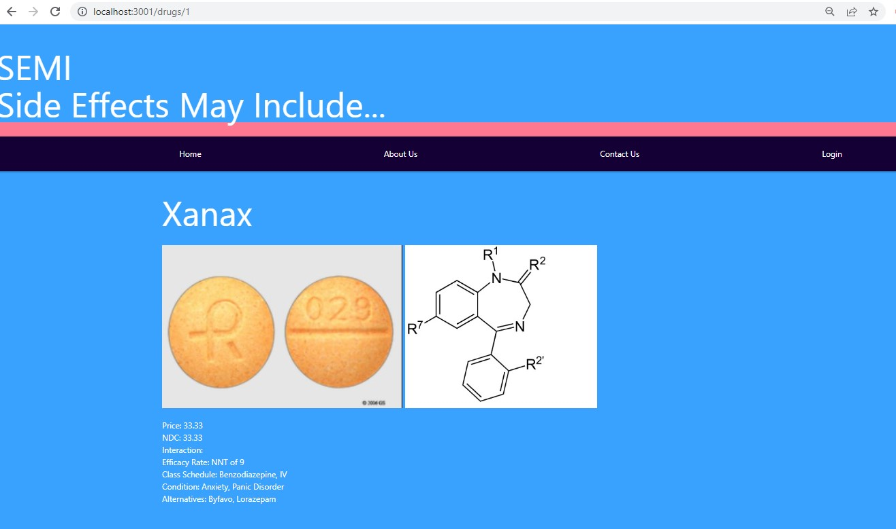
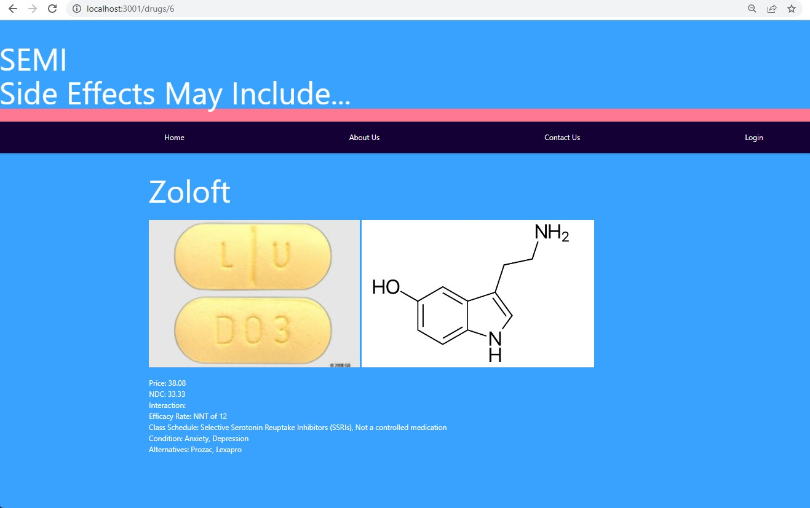

# SEMI

## Description

A short description explaining the what, why, and how of project "SEMI":

"S.E.M.I." or "Side Effects May Include" is a Simple medical informational application - it allows users to view prescriptions and obtain applicable data. After the user creates a profile or loggs in they can search the database for the desired medication. 

It provides powerful data about medications and their side effects in a user friendly way. It also gives a user the pricing information and efficacy of their prescription. 

Alternatives to the prescribed medication are also provided so a patient can have a meaningful discussion about their treatment, care,  and alternatives.


## Medical Disclaimer

This application may contain general information relating to various medical conditions and their treatment. Such information is provided for informational purposes only and is not meant to be a substitute for advice provided by a doctor or other qualified health care professionals. Patients should not use the information contained herein for diagnosing a health or fitness problem or disease. Patients should always consult with a doctor or other health care professional for medical advice or information about diagnosis and treatment.


## User Story

AS a User who is prescribed medication to treatment a condition. 

I WANT to be able to easily search for said prescription to obtain applicable data, to include price, efficacy, and possible alternatives.

SO THAT I can have an informed discussion with a medical professional about my healthcare.

## Installation

Pulling the GitHub repository from the follwing URL: https://github.com/RamRod79/semi2.git and typing the follwoing command ,'npm install', in the terminal will ensure the dependencies are installed and the program can run properly.

- Download and run mysql server.

- Download the repository to your own local machine and run it from your command line.

- Run ```npm i``` or ```npm install``` in order to download all the dependencies.

- MySQL instructions to create your tables:

        - Enter ```mysql -u root -p``` in the terminal window.
        - Enter your mysql password. 
        - In order to use your .sql files enter ```source db/schema.sql;``` and enter.
        - Enter ```USE semi_db;``` in the terminal window.
        - Exit MySQL by entering ```quit;```.
  
  Run ```npm run start``` in your terminal to start.

  Open Insomnia to run through the various API routes.

## Usage




## Credits

List of collaborators:

- UCLA Extension, Coding Bootcamp Instructor and TAs

## License

The following licenses have been used in the development of this project:

[](https://opensource.org/licenses/MIT)

## Badges


## Repo Features

Using this repo can be initiated by running 'npm run Start' in the command terminal after opening the integrated terminal to initiate the program. Using this repo requires the dependencies identified in the package.json file, and updated node modules to ensure application runs properly.

## How to Contribute

If other developers would like to contribute, you can contact jklongmire@gmail.com, st.tang91@gmail.com, or armando.rod79@gmail.com.

## URL
GitHub: https://github.com/RamRod79/semi2.git
Deployed: //https://semi2.herokuapp.com/

## Contact Info

For any other issues or comments please contact me at:

GitHub username: superdriift

Email: jklongmire@gmail.com

or

GitHub username: stang91

Email: st.tang91@gmail.com

or

GitHub username: RamRod79

Email: armando.rod79@gmail.com